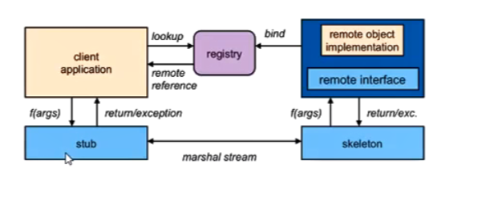

# RMI
#### Provider
1. 暴露服务：UnicastRemoteObject.exportObject()
2. 创建注册中心：LocateRegistry.createRegistry()
3. 注册服务：registry.rebind()

 

#### Consumer
1. 获取注册中心：LocateRegistry.getRegistry()
2. 服务发现：registry.lookup()
3. 服务调用：sayService.say()

#### 原理
- 就像调用本地方法一样调用，RMI会通过**stub客户端的代理对象，传递接口名、方法名、方法参数等信息**；
- 这些信息通过**注册中心找到对应提供这个方法的Provider**；
- 服务端通过**服务端的代理对象Skeleton调用并返回结果**。

